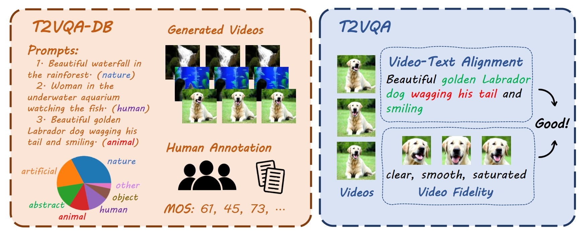

# T2VQA

  

This is the official repository for paper ["Subjective-Aligned Dateset and Metric for Text-to-Video Quality Assessment"](https://arxiv.org/abs/2403.11956). The code is coming soon.

## Database

Download the [T2VQA-DB](https://drive.google.com/file/d/1aak5hgYsXock19d1rVufss3_X6eEA4Wx/view?usp=sharing), including 1w text-generated videos with corresponding MOSs.
